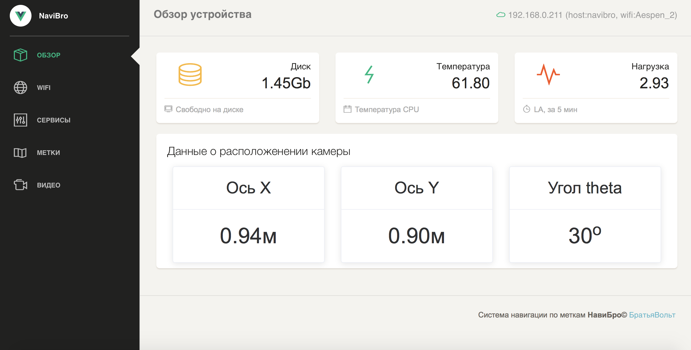
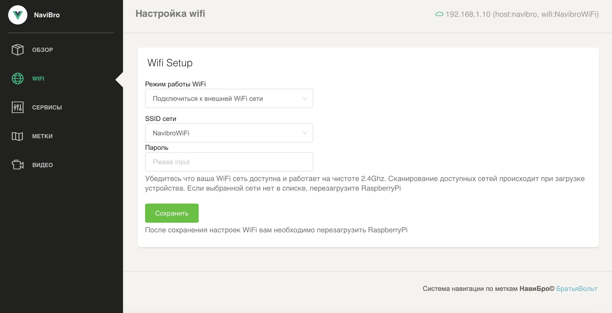
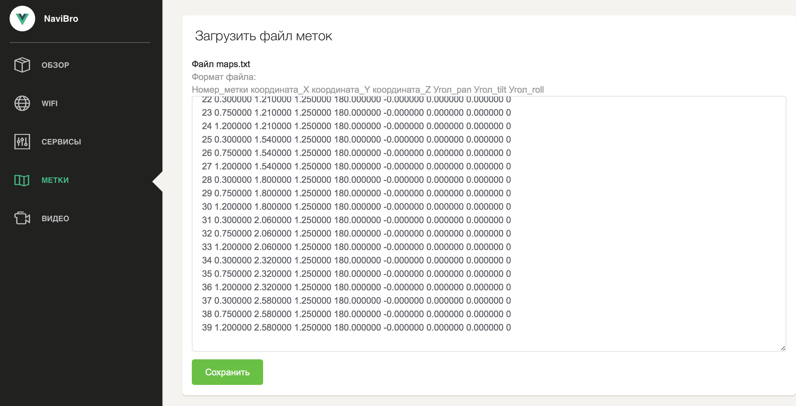

# Панель управления

## Обзор

Панель управления расположенна по адрессу [http://192.168.1.10:8000](http://192.168.1.10:8000) в случае поставки с роутером, или [http://10.42.0.1:8000](http://10.42.0.1:8000) в случае прямого подключения к RaspberryPi

Экран общей информации о модуле. Если камера видит метки, то обновляються данные с координатам. Также выводиться информация о текущем подключенни к сети, и информация мониторинга.



### Раздел WiFI

На этой странице возможно изменить и настроить тип подключения к WiFi \(Режим точки доступа, или работа с внешней wifi сетью\)




При подключении к внешней WiFi сети, IP адрес утсройства выдаст "внешний" DCHP сервер. Он может отличаться от предустановленного. Подключаться необходимо по новому IP


### Настройка рабочих сервисов 

Работа с Serial портом возможна в режиме `SimpleSerial` \(режим по умолчанию\) в котором данные о местоположении передаються простой строкой вида КоординатаX;КоординатаY;КоординатаZ;УголTheta. Например:

```text
"0.21;-0.21;2.1;110.21\n"
```

Также возможен режим работы `RosSerial`. Тогда на порту Serial запускаеться процесс RosSerial, который позволяет работать стандартными средствами. Документация по пакету доступна [http://wiki.ros.org/rosserial](http://wiki.ros.org/rosserial).

Передача данных с происходит в топиках `navibro/pose2d (Pose2D)`для двухмерных координат и `/fiducial_pose (PoseWithCovarianceStamped)` для трехмерных координат

Библиотека [ros\_lib.zip](https://github.com/voltbro/navibro_book/raw/master/assets/ros_lib.zip) для Arduino

### Метки

В разделе можно загрузить обновленную карту поля с метками.



Формат данных с данными о расположении меток  
`ID метки  
Координата X  
Координата Y  
Координата Z (Высота)  
Угол pan  
Угол tilt  
Угол roll   
0 (коэффициент variance)  
0 (коэффициент numObservations)`

По умолчанию загруженна карта для 1U стола \(см. [Установка маркерного поля](ustanovka-merkernogo-polya.md)\)

### Видео


Если изображение получилось не качественным, возможно настроить его параметры \(яркость, контрастность\) см. раздел \([Администрирование](administrirovanie-ros.md#nastroika-kamery)\)

