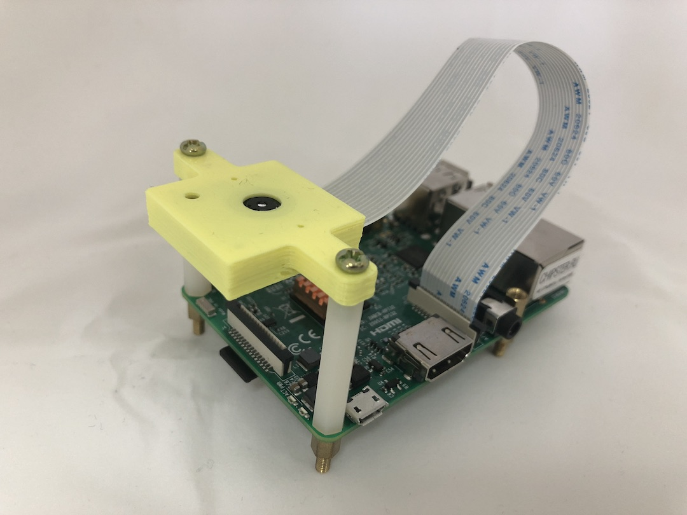

# Первый запуск

## Комплектация системы

| **Устройство** |  |
| --- | --- | --- | --- | --- | --- |
| Камера RaspberryPi v.1 | 1 шт |
| RaspberryPi 3 | 1 шт |
| SD карта с установленной ПО Navibro | 1 шт |
| Комплект крепления камеры | 1 шт |
| WiFi Роутер \* |  |

Наличие WiFi Роутера, зависит от комплектации поставки.

## Сборка и включение устройства

1. Проверить комплектацию
2. Зафиксировать плату камеры в фиксаторе для камеры. Камера должа без усилий фиксироваться. Иначе возможно отсоединение камеры от платы.
3. Присоеденить винтами фиксатор камеры к стойкам.
4. Установить фиксатор камеры со стойками к плате RaspberryPi
5. Подключить шлейф камеры к плате RaspberryPi \(в разьем Camera\)
6. Установить SD карту в RaspberryPi

ТУТ КАРТИНКА ГОТОВОЙ ПЛАТЫ

После сборки и проверки устройства, подключить питание к плате RasperryPi через MicroUSB  \(PWR IN\) разьeм. На плате Raspberry должны загореться красный светодиот \(питание\) и начнет моргать зеленый светоиод.

После завершения загрузки системы, светодиоды на плате Raspberry должны погаснуть, а светодиод на камере, должен светиться **красным цветом**.

Если все правильно настроено, и камеру направить на маркер, то через Serial порт RaspberryPi начнут передаваться данные о положении камеры. 

### Внешний вид собранного устройства

### Устранение неполадок

* После включения RaspberryPi на плате RaspberryPi не работают сигнальные светодиоды.
  1. Проверить подключение кабеля питания к плате.  
* На плате Raspberry горит только один красный светодиод.
  * Проверить установленна ли SD карта.
  * Проверить работоспособность SD карты. 
* После загрузки RaspberryPi не загораеться светодиод на плате камеры
  * Проверить подключение шлейфа между камерой и RaspberryPi
  * Снять камеру с фиксатора камеры и проверить разьем крепления камеры к плате камеры

