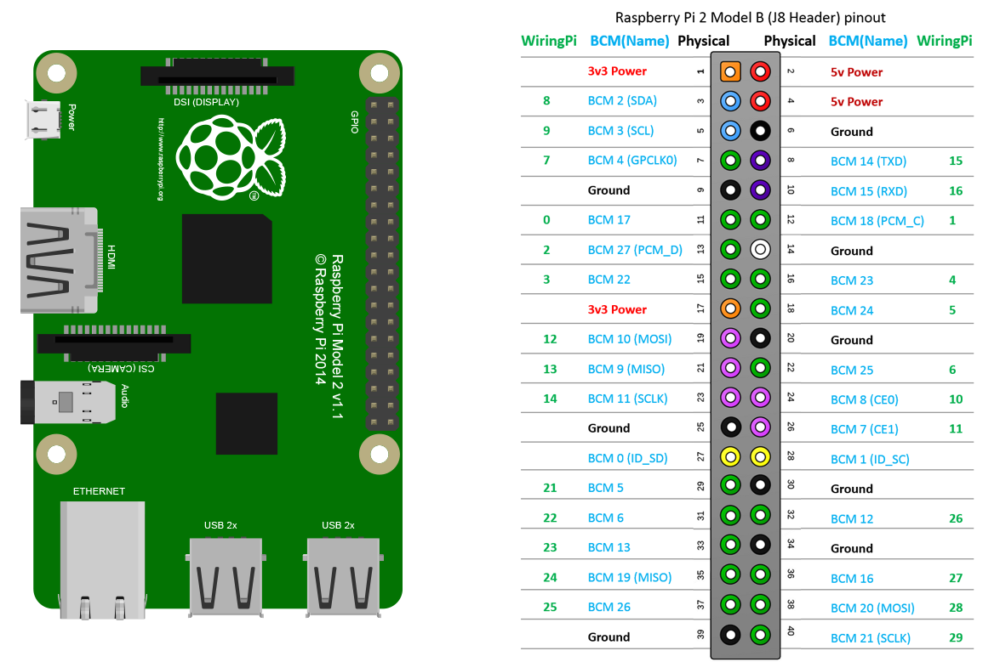

# Подключение и настройка

## Настройка сети

### Комплект поставки с роутером 

В комплект набора входит зарание настроенный роутер и плата RaspberryPi

* Включить роутер в сеть
  * Роутер создаст WiFi сеть NavibroWiFi
    * wifi login: `navibro`
    * wifi pass: `navibro2018` 
* Подключить компьютер к роутеру
  * Подключиться возможно как по WiFi так и Ethernet кабелем в порт 1-4 роутера
* Включить плату RaspberryPi, дождаться красного светодиода на плате камеры
  * RaspberryPi после загрузки подключится к сети NavibroWifi
* Открыть в браузер \(Chrome\) панель управления Navibro: [http://192.168.1.10:8000](http://192.168.1.10:8000) 

Администрирование роутера  [http://192.168.1.1](http://192.168.1.1) \(login: admin, pass: navibro2018\) рекомендуем подключить и настроить роутер для работы с интернетом. В общем случае достаточно подключить кабель с интернетом в разьем `WAN` роутера.

Если RaspberryPi не сможет подключиться к WiFi роутера, то RaspberryPi запустит собственную Wifi сесть `navibro_0001` \(где 0001 id устройства\) с авторизацией `navibro:navibro2018`. В этом случае панель управления Navibro [http://10.42.0.1:8000](http://10.42.0.1:8000)

### Вид панели управления Navibro

### Подключение к Serial

Подключение к Serial должно быть по пинам 15 и 16. Также важно сделать общую землю для Arduino и RaspberryPi

