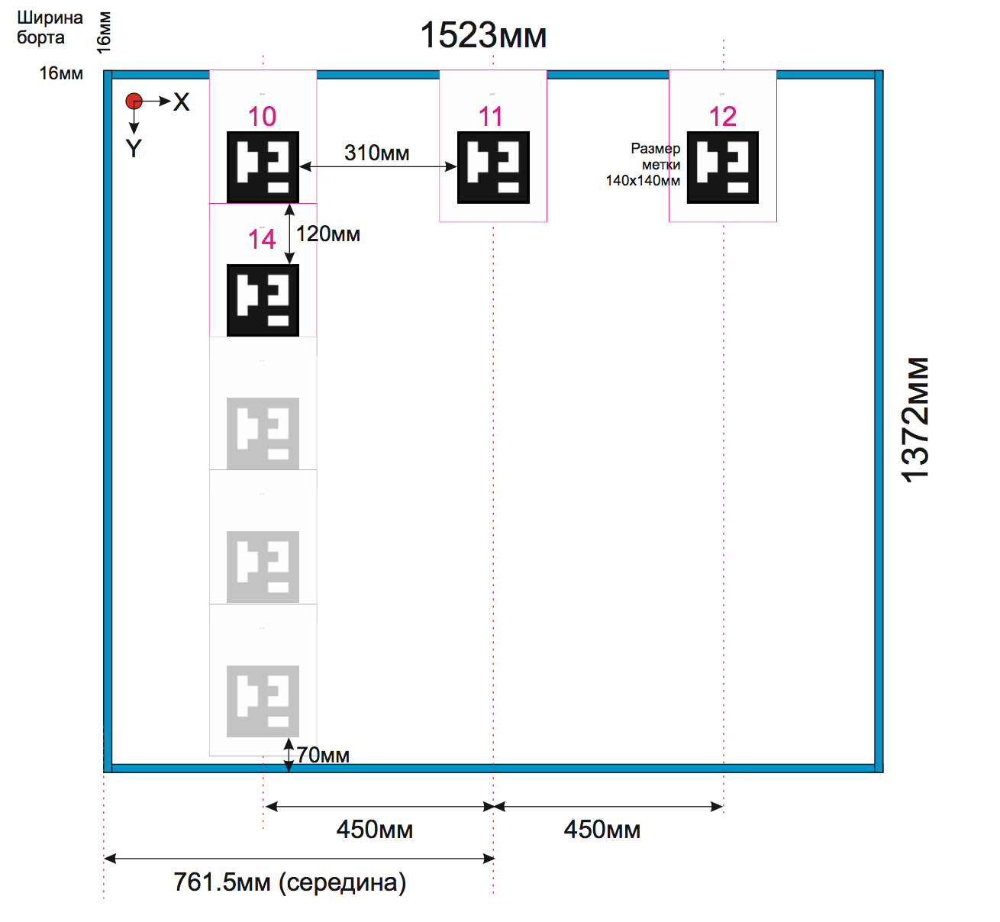

# Установка меркерного поля

Маркерное поле необходимо наклеить согластно инструкции на потолок собранного полигона.

Если возможности повторить поле согластно инструкции нет, то необходимо откорректировать файл с данными о [поле меток](panel-upravleniya.md#metki)

Метки распечатываются на самоклеящейся бумаге размера А4, в 100% масштабе \(из альбома меток\). Расклеиваются метки строго в указанном порядке - номера идут рядами. Размещение метки на листе сделано таким образом, что е верхний край находится в 12 см от края листа. Начинать расклейку надо от края секции потолка и наклеивать следующую метку в нахлест в стык к предыдущей. Это сохранит указанные расстояния. Расстояния между центрами столбцов меток \(красный пунктир\) - 450мм. Центральная линия проводится по центру листа. 

В настроечном файле навигации вам необходимо учитывать что при смене секции \(каждые рядов меток\) их координаты сдвигаются по оси Y на дополнительные 70мм.

Файл для печати меток [Frame-Album-A4-Metki.pdf](https://github.com/voltbro/navibro_book/raw/master/assets/Frame-Album-A4-Metki.pdf)

Общий вид маркерного поля на полигоне 1U

